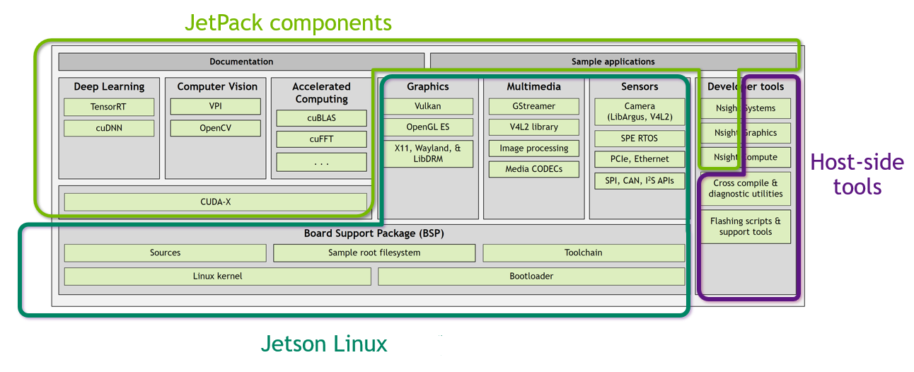

## Jetson software architecture

## Documentation
[Jetson Linux API Reference](https://docs.nvidia.com/jetson/l4t-multimedia/index.html) 

## Deep learning
### NVidia TensorRT 
Provides a high-performance neural network inference engine for production deployment of deep learning applications. It can be used to optimize, validate, and deploy trained neural networks for inference to the Jetson platform. The Multimedia API provides samples that use this engine.

So it's basically trained neural network for objects recognition or other tasks.

### NVidia cuDNN
Provides a GPU-accelerated library of primitives for deep neural networks. cuDNN provides highly tuned implementations for standard routines such as forward and backward convolution, pooling, normalization, and activation layers.

It's the lowest mathematical layer for all neural network computations. All the parallel math is happening here.

### NVidia Triton
Is an open-source inference serving software that helps standardize model deployment and execution and delivers fast and scalable AI in production.
It helps to delivery ready models on Jetson.

## Computer Vision
Computer vision concerns capturing and processing images and video streams from sensors (cameras), tracking features, and performing various types of transformation such as dewarping and color transformation.

### Vision programming interface
A software library that implements computer vision and image processing algorithms on multiple hardware accelerators present in Jetson modules.
Basically it's a library through wich we implement whole computer vision on Jetson platform.

### OpenCV 
Provides a version of OpenCV that NVIDIA has optimized specifically for the Jetson platform. It contains Jetson-specific optimizations that enable it to run faster than the OpenCV implementation.
So it's a low-level library, which is used from VPI, created specifically for Jetson.

## Accelerated computing
Accelerated computing provides highly optimized libraries which applications may use to execute computation-intensive primitives in parallel on the GPU.
### cuBLAS
CUDA Basic Linear Algebra Subroutines, a software library that supports GPU-accelerated linear algebra operations.
It contains all main linear algebra algorithms for GPU usage.

### cuFFT
CUDA Fast Fourier Transforms, a software library that supports GPU-accelerated fast Fourier transforms.

## Graphics
These next libraries/drivers which a give full control on using GPU for computations.
### Vulkan
A low-level API that gives direct access to the GPU to developers.

### OpenGL ES
A cross-platform API for full-function 2D and 3D graphics on embedded systems.

### X Driver
A GPU-accelerated implementation of X driver.

### Wayland
GPU-accelerated implementation of Weston, a compositor based on Wayland protocol.

### libDRM
A library that provides access to the Linux Direct Rendering Manager (DRM). It consists of a driver and a user space library. The Jetson Linux implementation uses a GPU to accelerate its operations.

## Multimedia
Multimedia components support video stream processing and other types of multimedia processing.

### Gstreamer
Provides a higher-level multimedia API. This framework provides the same types of capabilities as the Multimedia API, but at a higher level.
The GStreamer framework is included in the Jetson Linux distribution. It is installed by SDK Manager.

### V4L2 library
Supports the V4L2 (Video for Linux, version 2) API as an extension to the Multimedia API; includes a video converter, decoder, and encoder.

## Sensors
Sensor components capture input from sensors (cameras) and perform the initial stages of processing on them. They provide high-level building blocks for implementing sensor processing, and provide GPU acceleration to many steps.

### Camera (Libargus/V4L2)
A low-level API based on the camera core stack.
SDK Manager installs this component as part of the Multimedia API which provides a collection of APIs that supports flexible application development with better control over the underlying hardware blocks.

### SPE RTOS
Provides software access to the Sensor Processing Engine (SPE), a component of a Jetson module’s ARM® Cortex™-R5 microcontroller that supports hardware-accelerated sensor input processing.

### PCI/Ethernet

### SPI/CAN/I2 S APIs

## CUDA-X
NVIDIA® CUDA® is a parallel computing platform that makes it easy to use a GPU for general purpose computing. It is particularly useful for implementing graphical applications. It can be used with any of several programming languages.
CUDA‑X is a package that includes CUDA and CUDA-based implementations of several common graphics-oriented tasks.

## Board Support Package
The Jetson Linux Board Support Package (BSP) contains all of the software you need to develop and run applications with Jetson Linux. The current Jetson Linux BSP is available from the Jetson Linux page on the NVIDIA Developer Site. It includes:

### Sources
Jetson Linux is an open source product. Source code is included in the Jetson Linux distribution.
### Sample root file system
A root file system derived from the Ubuntu distribution. You can use this root file system as a basis for developing one that is tailored to your application.
### Jetson Linux toolchain
A suite of software components used to developer Jetson Linux applications.
### Jetson Linux Kernel
A version of the Ubuntu Linux kernel that NVIDIA has optimized for use on Jetson devices.
### Bootloader
Boot software for an operating system on a Jetson device.

## Developer Tools
NVIDIA provides a full suite of developer tools for writing, building, and debugging Jetson Linux applications.

### NVIDIA® Nsight™
NVIDIA Nsight profiles application execution across multiple CPU cores and helps you improve application performance by identifying slow parts of your code.
Runs on the Linux host computer. Supports all Jetson products.
### Nsight Graphics
Debugs and profiles OpenGL and OpenGL ES graphics programs through a console interface.
### Nsight Systems Compute
Interactively profiles kernel operations for CUDA applications. Provides detailed performance metrics and API debugging via a user interface and command line tool.
### Cross-compiler and diagnostic utilities
Jetson Linux BSP includes a toolchain for compiling applications on an Ubuntu host system, and a suite of development tools for debugging and optimizing them.
### Flashing Support
Scripts and associated tools to assist in flashing software to a Jetson device.

## Other Components
### Jetson Linux user space drivers
NVIDIA drivers that run in user space.
### Multimedia API (MMAPI)
A collection of lower-level APIs that support flexible application development. Multimedia API includes:
- Libargus for imaging applications
- Buffer API for buffer allocation, management, and sharing
- NVOSD for on-screen display
- Application framework APIs (optional)
MMAPI also includes samples that demonstrate image processing with CUDA, and object detection and classification with cuDNN, TensorRT, and OpenCV4Tegra.
MMAPI is for developers who use a custom framework or wish to avoid a framework like GStreamer.
MMAPI must be separately downloaded from the NVIDIA Jetson Download Center. It is not included in Jetson Linux BSP.

## CUDA Toolkit
### Toolkit for Ubuntu host with cross deployment support
CUDA toolkit for the host.
### CUDA Toolkit
CUDA toolkit for use with the Jetson Developer Kit.
### CUDA MPS

## Graphics
### OpenGL
Open Graphics Library API for rendering vector graphics.
### EGL™
Interface between Khronos rendering APIs such as OpenGL ES or OpenVG and the underlying native platform window system.

## JetPack SDK

### NVIDIA JetPack™ SDK documentation
Provides details for your development on the Jetson platform.
### Samples
Designed to give you hands-on, practical examples for using the Jetson development platform.